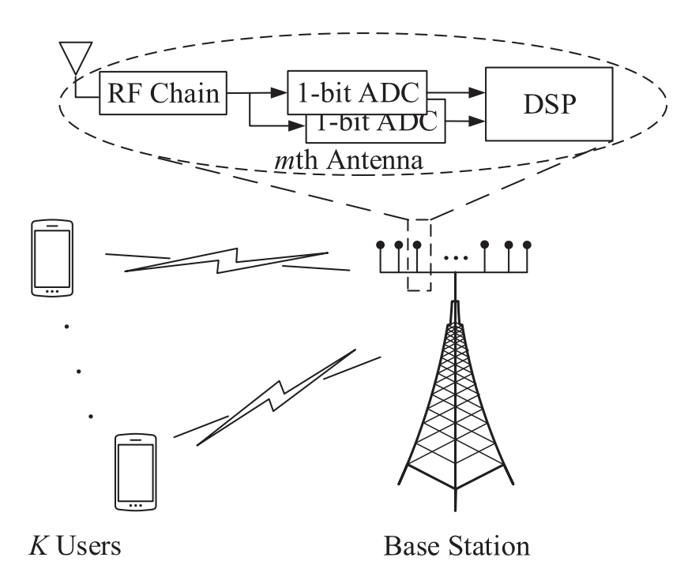

# Channel Estimation
## Channel estimation for uplink massive MIMO with 1-bit-ADC 

### _Abstract_
- propose an approach for channel estimation that is applicable for both flat and frequency-selective fading.
- derive closed-form expressions for the achievable rate in flat fading 
- Low SNR 

### $\text{I. Introduction}$ 
Massive MIMO - Power consumption matters 

The use of **Low Resolution(1-3bits) ADCs** is a potential solution to this problem [11]-[18]. 

[11] - Capacity Maximizing transmit signals for one-bit ADCs : Discrete unlike infinite resolution where Gaussian is optimal

Channel Estimation with 1-bit-ADC: 
[20]~[28]
- [24] - modified EM algorithm using sparsity
- [25] - near Maximum Likelihood (nML) (Channel Estimator & detector proposed)
- [28] - low complexity channel estimator 

single-cell with 
- $K$ : Number of single-antenna user 
- $M$ : Number of antenna in BS 
- $M \gg K \gg 1$
- received signal at the BS 

$$
\textbf{y} = \sqrt{\rho_{d}}\textbf{Hs} + \textbf{n}
$$

- $\textbf{n} \backsim \mathcal{CN} (\mathbf{0, I}_M)$
- Channel Matrix: $\textbf{H} \in \mathbb{C}^{M \times K}$ 
- Vectorized Channel Matrix: $\underbar{\textbf{h}} = \text{vec}(\mathbf{H})$
- Assume:  $E\{|s_k|^{2}\}=1$ 
    
all users have the same level of large-scale fading/$\textbf{SNR}$ $\rho_d$

The quantized signal obtained after the one-bit ADCs:

$$
\textbf{r} = \mathcal{Q}(\textbf{y}) = \mathcal{Q}(\sqrt{\rho_d}\mathbf{Hs}+\mathbf{n})
$$

- $\mathcal{Q}$ represents (one-bit) Quantization function 
- $\mathcal{Q} = \frac{1}{\sqrt{2}}(\text{sign}(\mathfrak{R}(\cdot)) + j \text{sign}(\mathfrak{R}(\cdot))$ 

Coherence Interval is divided into two parts: dedicated to 

1. __training__ : all $K$ users simultaneously transmit their pilot sequences of $\tau$ symbols each to BS
2. data transmission

### 1. Training 
all $K$ users simultaneously transmit their pilot sequences of $\tau$ symbols each to Base station 

$$
\textbf{Y}_p = \sqrt{\rho_p}\mathbf{H\Phi}^T + \mathbf{N}_p
$$

- $\mathbf{Y}_p \in \mathbb{C}^{M\times \tau}$ : received signal
- $\mathbf{\Phi} \in \mathbb{C}^{\tau \times K}$ : **pilot matrix** (Column wise orthogonal)
- i.e., $\mathbf{\Phi}^T\mathbf{\Phi} = \tau \mathbf{I}_K$ 

    implies $\tau \geq K$

**Change it to vector form** 

$$
\text{vec}(\mathbf{Y}_p) = \mathbf{y}_p = \bar{\mathbf{\Phi}}\underline{\mathbf{h}} + \underline{\mathbf{n}}_p
$$

- $\bar{\mathbf{\Phi}} = \mathbf{\Phi} \otimes \sqrt{\rho_p} \mathbf{I}_M$ 
- $\underline{\mathbf{n}}_p = \text{vec}(\mathbf{N}_p)$

$$ 
\mathbf{r}_p = \mathcal{Q}(\mathbf{y}_p)
$$

 

